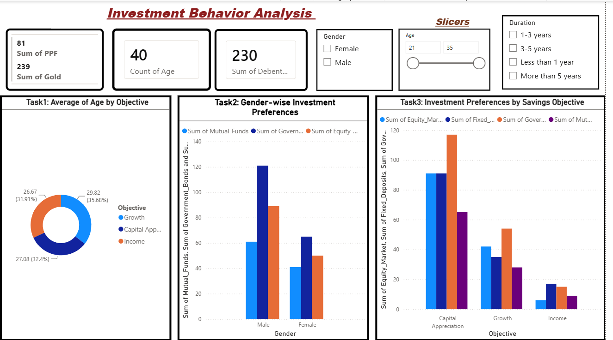
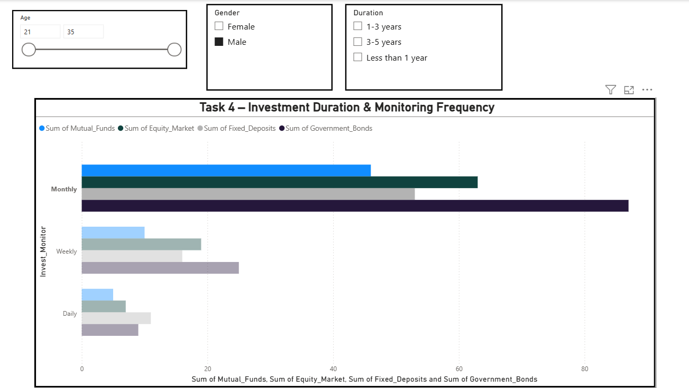
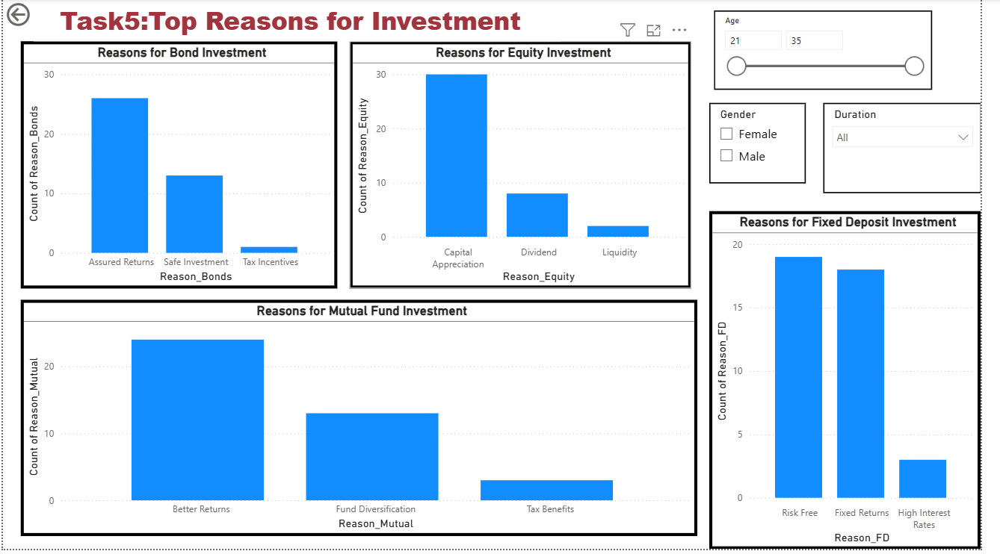
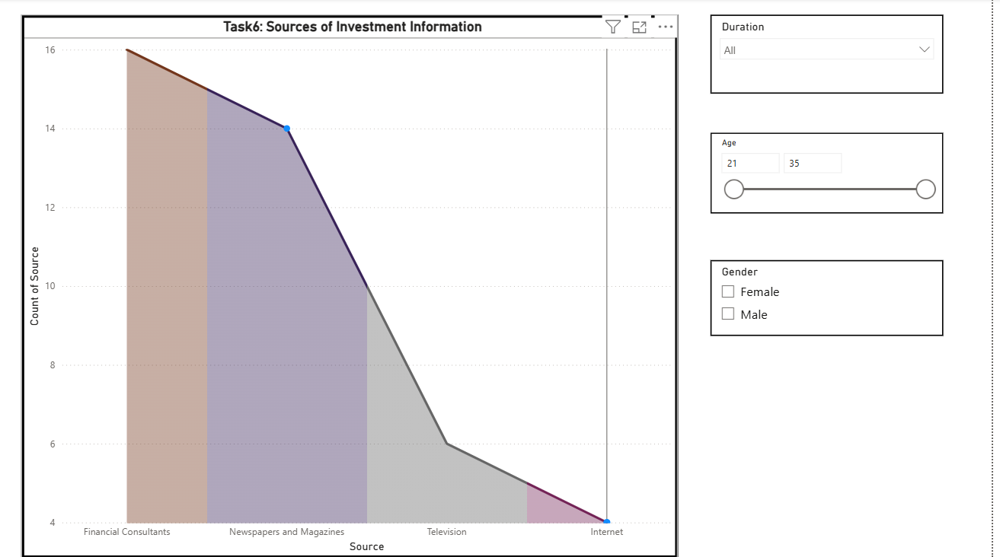

# Investment Behavior Analysis Dashboard

A Power BI dashboard exploring how investment preferences and habits vary across demographics — built to help understand what drives investment decisions and where financial awareness gaps exist.

## 📊 Overview

This is a 6-page interactive Power BI dashboard analyzing investment behavior data, with dynamic slicers for **age**, **gender**, and **investment duration**.

## 🔍 What it covers

- **Investment preferences by gender** — how choices differ across demographic groups
- **Savings objectives** — what people are actually saving/investing for
- **Monitoring frequency** — how often investors track their portfolios
- **Top reasons for product choice** — key drivers behind picking bonds, equity, mutual funds, and fixed deposits
- **Sources of investment information** — where investors get their guidance from (advisors, online, family/friends, etc.)

## 🛠️ Tools & Skills

- Power BI (data modeling, DAX measures, interactive slicers)
- Data cleaning and transformation in Power Query
- Dashboard/UX design for multi-page reports

## 📁 Repo contents

| File | Description |
|---|---|
| `Chaitrali Investment Analysis Dashboard.pbix` | Power BI dashboard file |
| `page1-overview.png` | Objective breakdown, gender & savings-objective preferences |
| `page2-monitoring.png` | Investment duration & monitoring frequency |
| `page3-reasons.png` | Top reasons for choosing each investment type |
| `page4-sources.png` | Sources of investment information |

## 📸 Preview

**Page 1 — Overview** (Objective breakdown, gender-wise preferences, savings-objective preferences)

**Page 2 — Investment Duration & Monitoring Frequency**

**Page 3 — Top Reasons for Investment**

**Page 4 — Sources of Investment Information**

## 💡 Key Insights

- **Objectives are nearly evenly split** — Growth (35.7%), Income (32.4%), and Capital Appreciation (31.9%) — no single financial goal dominates this investor group
- **Monthly monitoring dominates across all instruments**, with government bond investors tracking most actively — a shift toward periodic, hands-off tracking rather than daily/weekly check-ins
- **Trust drives investment choice**: Assured Returns is the top reason for bonds, Capital Appreciation for equity, Better Returns for mutual funds, and Risk-Free status for fixed deposits — safety and reliability outweigh aggressive growth narratives
- **Financial consultants remain the #1 information source** — ahead of newspapers, TV, and even the internet, notable for a 21–35 age group typically assumed to be digital-first

## 🚀 About

Built as part of independent data analytics practice by Chaitrali Ambrale — MBA (Business Analytics) student and aspiring Data Analyst, with hands-on experience in Power BI, SQL, Excel, DAX, and Python.

[LinkedIn](#) • [Resume](#)
